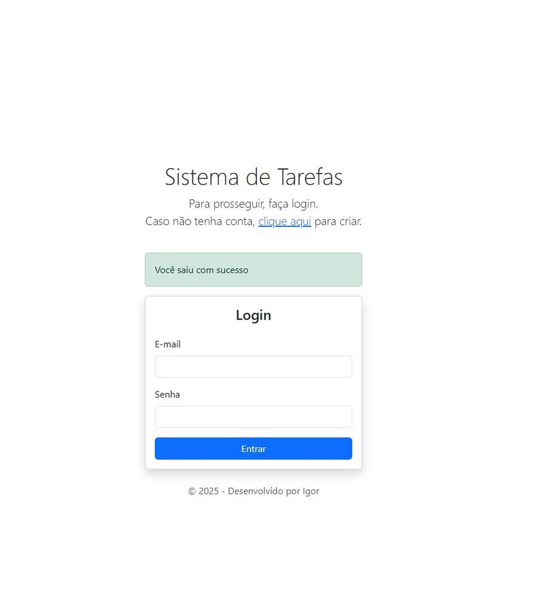
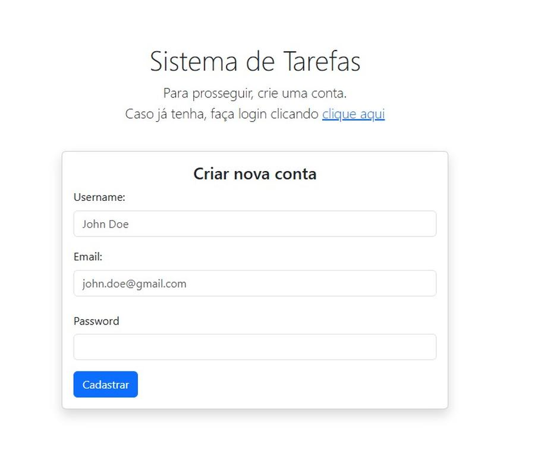
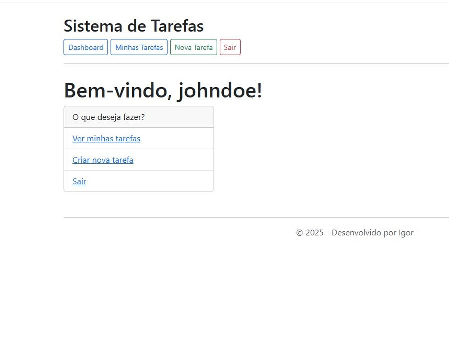
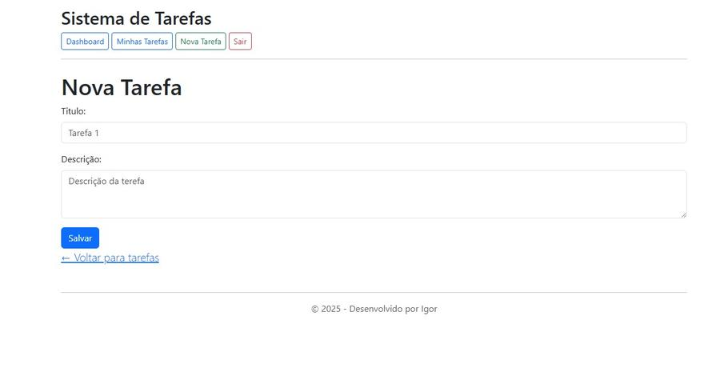
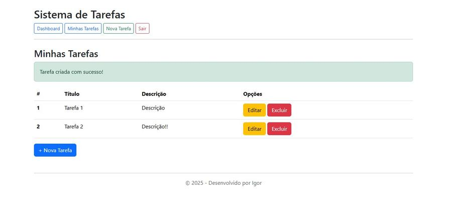
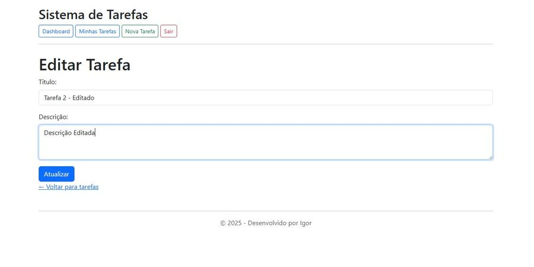
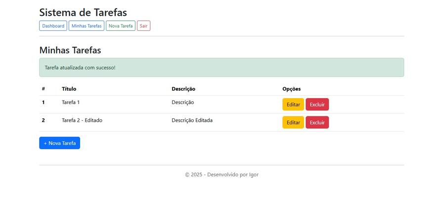

# 📝 Sistema de Tarefas com Login

Um sistema simples de gerenciamento de tarefas com autenticação de usuários, desenvolvido com CodeIgniter 4, PHP e MySQL.

## 🚀 Funcionalidades

- Cadastro e login de usuários com senha criptografada
- CRUD completo de tarefas
- Cada usuário visualiza apenas suas próprias tarefas
- Validações de formulário com mensagens personalizadas
- Proteção CSRF integrada
- Interface responsiva com Bootstrap 5

## 🛠️ Tecnologias Utilizadas

- [CodeIgniter 4](https://codeigniter.com/)
- PHP 8.x
- MySQL
- HTML5, CSS3 e Bootstrap 5

## 📦 Instalação

1. Clone o repositório:

   ```bash
   git clone https://github.com/igor-exception/tarefas.git
   cd tarefas
   ```

2. Instale as dependências com Composer:

   ```bash
   composer install
   ```

3. Configure as variáveis de ambiente:

   - Copie o arquivo `.env.example` para `.env`:

     ```bash
     cp .env.example .env
     ```

   - Edite o `.env` com as credenciais do seu banco de dados MySQL.

4. Crie o banco de dados (necessário antes de rodar as migrations):

   ```bash
   mysql -u SEU_USUARIO -p < create_database.sql
   ```

5. Execute as migrations para criar as tabelas:

   ```bash
   php spark migrate
   ```

6. Inicie o servidor de desenvolvimento do CodeIgniter:

   ```bash
   php spark serve
   ```

7. Acesse o sistema em `http://localhost:8080`.

## 📊 Dados de Exemplo (opcional)

Se você quiser importar um banco já com usuários e tarefas cadastradas para testes, use o arquivo `tarefas_portfolio.sql`. Esse arquivo sobrescreve tudo (estrutura e dados).

> ⚠️ **Atenção**: isso irá substituir as tabelas e dados atuais.

1. Certifique-se de que o banco `tarefas_portfolio` existe (use `create_database.sql` se necessário):

   ```bash
   mysql -u SEU_USUARIO -p < create_database.sql
   ```

2. Importe o banco completo com dados de exemplo:

   ```bash
   mysql -u SEU_USUARIO -p tarefas_portfolio < tarefas_portfolio.sql
   ```

> ✅ Após isso, **não é necessário rodar `php spark migrate`**, pois as tabelas já estarão criadas com dados.

## 🔐 Segurança

- Proteção contra CSRF ativada
- Senhas armazenadas com `password_hash()`
- Validações de entrada robustas
- Controle de acesso baseado em sessão

## 📸 Screenshots

### Tela de Login


### Confirmação de Logout


### Cadastro de Usuário


### Dashboard


### Nova Tarefa


### Minhas Tarefas


### Edição de Tarefa


## 👨‍💻 Autor

**Igor Oliveira**
